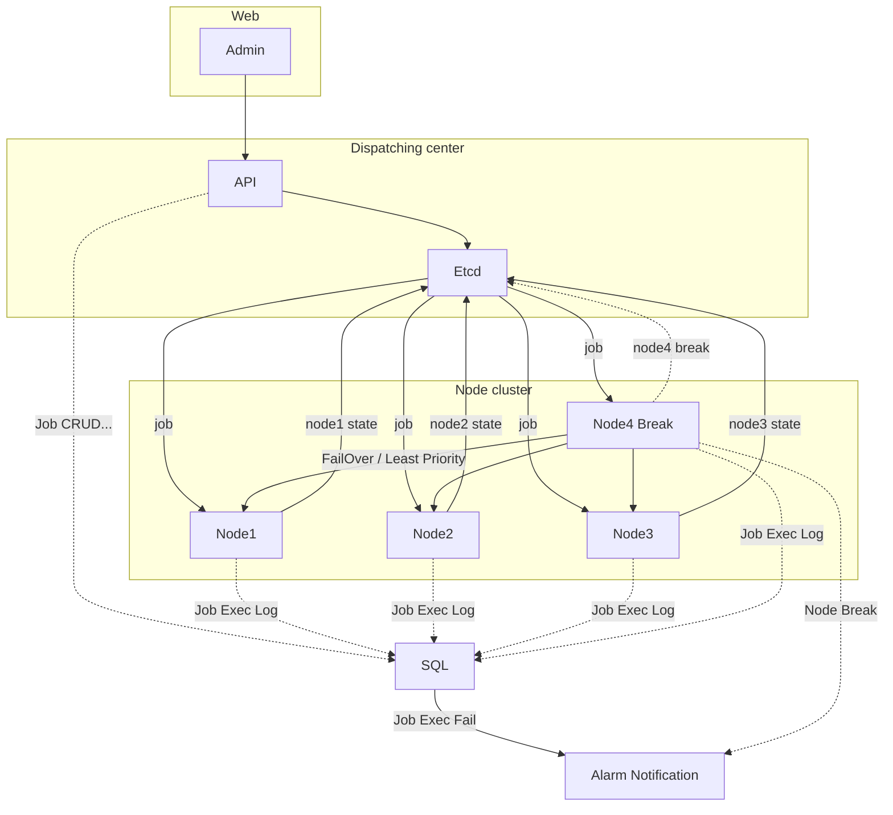
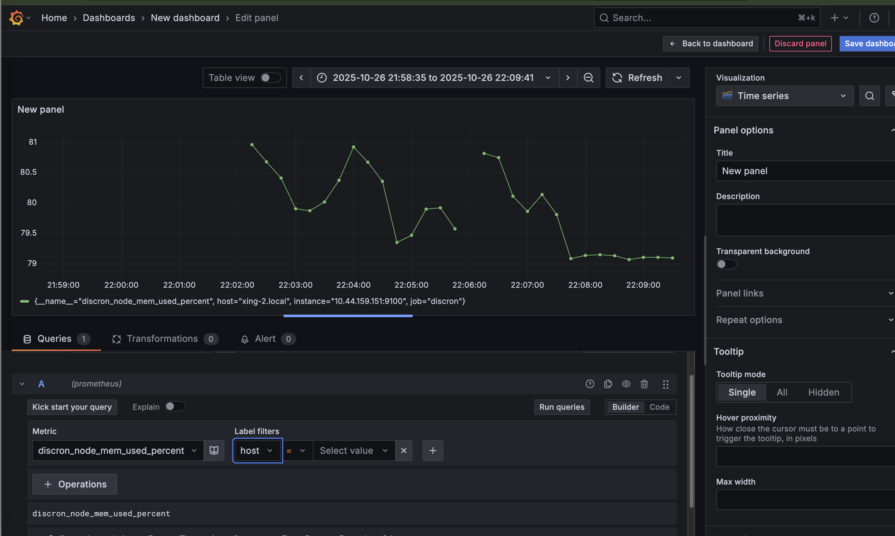

# DistCron--分布å¼å®šæ—¶ä»»åŠ¡è°ƒåº¦ç³»ç»Ÿ

> 一款轻é‡çº§åˆ†å¸ƒå¼å®šæ—¶ä»»åŠ¡è°ƒåº¦ç³»ç»Ÿï¼Œæ”¯æŒä»»åŠ¡çš„集中管ç†ã€èŠ‚点分å‘执行ä¸çŠ¶æ€ç›‘æ§ï¼Œæ— éœ€ä¾èµ–第三方平å°ï¼ˆå¦‚ Discord），适用äºä¸­å°è§„模æœåŠ¡çš„定时任务场景（如数æ®åŒæ­¥ã€æ—¥å¿—清ç†ã€æ¥å£å·¡æ£€ç­‰ï¼‰ç›®å‰æ”¯æŒï¼š
* cmd 任务
* http 任务

## 🌟 核心功能
* 分布å¼æ¶æ„：支æŒå¤šæ‰§è¡ŒèŠ‚点（node）部署，任务自动分å‘，é¿å…å•ç‚¹æ•…éšœ
* çµæ´»çš„任务é…置：兼容标准 Cron 表达å¼ï¼Œæ”¯æŒä»»åŠ¡ä¼˜å…ˆçº§ã€è¶…时时间ã€é‡è¯•ç­–ç•¥é…ç½®
* 集中å¼ç®¡ç†ï¼šæ供管ç†æ¨¡å—（admin），支æŒä»»åŠ¡åˆ›å»ºã€ç¼–辑ã€å¯åœã€æ—¥å¿—查询等
* 任务æŒä¹…化：通过数æ®å­˜å‚¨æ¨¡å—（需é…置数æ®åº“ / 本地文件）确ä¿ä»»åŠ¡é‡å¯ä¸ä¸¢å¤±

``` mermaid
graph TD
    %% 顶层：用户交互层
    subgraph Web
        Admin["Admin"]
    end

    %% 调度层
    subgraph "Dispatching center"
        API["API"]
        Etcd["Etcd"]
    end

    %% 节点集群
    subgraph "Node cluster"
        Node1["Node1"]
        Node2["Node2"]
        Node3["Node3"]
        Node4["Node4 Break"]
    end

    %% æ•°æ®åº“ & å‘Šè­¦
    SQL["SQL"]
    Alarm["Alarm Notification"]

    %% 关系è¿çº¿
    Admin --> API --> Etcd

    %% 作业 CRUD æµç¨‹
    API -.->|Job CRUD...| SQL

    %% etcd ä¸èŠ‚点通信
    Etcd -->|job| Node1
    Etcd -->|job| Node2
    Etcd -->|job| Node3
    Etcd -->|job| Node4

    Node1 -->|node1 state| Etcd
    Node2 -->|node2 state| Etcd
    Node3 -->|node3 state| Etcd
    Node4 -.->|node4 break| Etcd

    %% 节点之间 failover
    Node4 -->|FailOver / Least Priority| Node1
    Node4 --> Node2
    Node4 --> Node3

    %% Job 执行日志ä¸å¤±è´¥
    Node1 -.->|Job Exec Log| SQL
    Node2 -.->|Job Exec Log| SQL
    Node3 -.->|Job Exec Log| SQL
    Node4 -.->|Job Exec Log| SQL

    SQL -->|Job Exec Fail| Alarm
    Node4 -.->|Node Break| Alarm
```

## è¿è¡Œæˆªå›¾

**节点状æ€ä¸è´Ÿè½½ä¿¡æ¯**

**Grafana å¯è§†åŒ– Dashboard**

